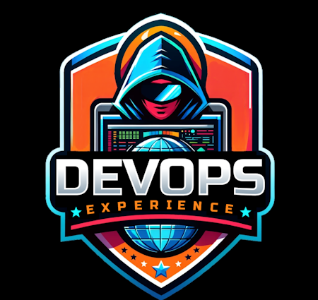
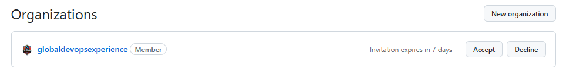
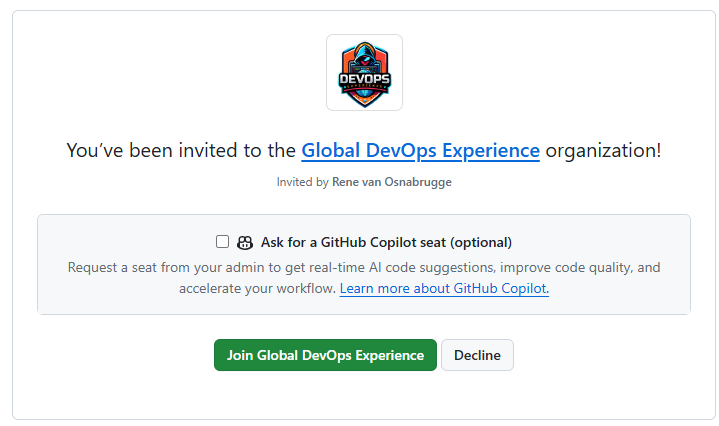

## Welcome to the Global DevOps Experience

Welcome to the **Global DevOps Experience** organisation on GitHub. 

This is the place on GitHub where we develop and host the experience. The Global DevOps Experience is a worldwide community event around GitHub, Azure and AI and will be held on 15th of June. If you want to learn more about the event, then visit our [page](https://www.globaldevopsx.com)

## For participants
If you registered for the event on our website you should have had a invitation for the the event to be  enrolled in our GitHub Organization.

To accept the invitation follow the following steps
* Navigate to https://github.com/settings/organizations
* Login with the registered GitHub Account

* Accept the invitation next the globaldevopsexperience org

## Join the event
If you did not register yet, you can still do that on https://globaldevopsx.com.

Once you are registered and accepted the invitation you can go the the [Event Day](https://globaldevopsx.com/event-day) page to start your experience!